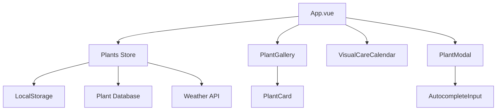

# 🌿 Garden Manager

A modern, feature-rich web application for tracking and managing your garden plants. Built with Vue 3, this application helps you monitor plant health, schedule care, and maintain a comprehensive garden database.


## ✨ Features

### 🌱 **Plant Management**
- **Add/Edit Plants**: Comprehensive plant information with photos, types, and planting dates
- **Smart Autocomplete**: Extensive plant database with 100+ common plants for easy input
- **Health Tracking**: Monitor plant health status (Healthy, Needs Attention, Sick)
- **Growth Milestones**: Track important growth events and achievements
- **Care History**: Maintain detailed records of all care activities

### 🔍 **Organization & Discovery**
- **Advanced Search**: Search across plant names, types, locations, and notes
- **Multiple Sorting**: Sort by name, age, attention needed, planting date, or health status
- **Visual Gallery**: Beautiful grid layout with plant photos and quick stats
- **Pagination**: Efficient browsing with customizable items per page (6-48 plants)

### 📅 **Care Management**
- **Care Scheduling**: Set daily, weekly, bi-weekly, or monthly care routines
- **Visual Calendar**: Interactive calendar showing upcoming and overdue care tasks
- **Care Reminders**: Visual indicators for plants needing attention
- **Care Tracking**: Log care activities with dates and notes

### 🔧 **Advanced Operations**
- **Bulk Operations**: Select and manage multiple plants simultaneously
- **Data Export**: Export garden data to formatted Markdown files
- **Data Import**: Import plant collections from Markdown files
- **Duplicate Detection**: Prevent duplicate plant entries automatically

### 🌤️ **Smart Features**
- **Weather Integration**: Get weather-based care recommendations (mock data included)
- **Seasonal Tips**: Contextual gardening advice based on current season
- **Plant Suggestions**: AI-powered plant type recommendations based on names

### 💾 **Data Management**
- **Local Storage**: Automatic data persistence with storage quota management
- **Error Handling**: User-friendly error messages and success notifications
- **Data Validation**: Comprehensive input validation and error prevention
- **Storage Warnings**: Alerts when approaching storage limits

## 🏗️ Architecture

### **Tech Stack**
- **Frontend**: Vue 3 (Composition API)
- **State Management**: Pinia
- **Styling**: CSS3 with Glass-morphism design
- **Build Tool**: Vite
- **Storage**: LocalStorage with quota management

### **Component Structure**
```
src/
├── App.vue                     # Main application container
├── main.js                     # Application entry point
├── style.css                   # Global styles
├── stores/
│   └── plants.js              # Pinia store (state management)
└── components/
    ├── AppHeader.vue          # Header with search, sort, and actions
    ├── PlantGallery.vue       # Main plant grid with pagination
    ├── PlantCard.vue          # Individual plant display cards
    ├── PlantModal.vue         # Add/edit plant form (🆕 Enhanced accessibility)
    ├── PlantDetailsModal.vue  # Detailed plant information
    ├── VisualCareCalendar.vue # Interactive care calendar (🆕 Fixed timezone issues)
    ├── AutocompleteInput.vue  # Smart input with suggestions
    ├── ErrorToast.vue         # User notifications (🆕 Added)
    ├── LoadingSpinner.vue     # Loading states (🆕 Added)
    ├── StorageWarning.vue     # Storage quota warnings
    ├── CareCalendar.vue       # Care scheduling component
    ├── DetailedCareInstructions.vue # Detailed care guidance
    ├── PlantGrowthTimeline.vue # Growth tracking component
    └── WeatherIntegration.vue # Weather-based recommendations
```

### **Data Flow**


### **State Management**
- **Centralized Store**: All plant data managed through Pinia store
- **Reactive Updates**: Real-time UI updates on data changes
- **Computed Properties**: Efficient filtering, sorting, and searching
- **Action-based Mutations**: Consistent data modifications

## 🚀 Getting Started

### **Prerequisites**
- Node.js 16+ 
- npm or yarn package manager

### **Installation**

1. **Clone the repository**
   ```bash
   git clone <repository-url>
   cd gardendb
   ```

2. **Install dependencies**
   ```bash
   npm install
   ```

3. **Start development server**
   ```bash
   npm run dev
   ```

4. **Open in browser**
   Navigate to `http://localhost:5173`

### **Development Commands**
```bash
# Start development server with hot reload
npm run dev

# Build for production
npm run build

# Preview production build
npm run preview

# Lint code (if ESLint is configured)
npm run lint
```

## 📦 Deployment

### **Static Hosting (Recommended)**

The app builds to static files and can be deployed to any static hosting service:

1. **Build the application**
   ```bash
   npm run build
   ```

2. **Deploy the `dist/` folder to your hosting service:**
   - **Netlify**: Drag and drop the `dist` folder
   - **Vercel**: Connect your repository and set build command to `npm run build`
   - **GitHub Pages**: Push `dist` folder to `gh-pages` branch
   - **Surge.sh**: `surge dist/`

### **Server Deployment**

For server-based deployment:

1. **Build the application**
   ```bash
   npm run build
   ```

2. **Serve static files**
   ```bash
   # Using a simple HTTP server
   npx serve dist
   
   # Or configure your web server (nginx, apache) to serve the dist folder
   ```

### **Environment Configuration**

For production deployment with real weather API:

1. **Get OpenWeatherMap API key**
   - Sign up at [OpenWeatherMap](https://openweathermap.org/api)
   - Get your free API key

2. **Update weather integration**
   - Edit `src/stores/plants.js`
   - Replace mock weather data with real API call
   - Add your API key to the fetch URL

## 📖 Usage Guide

### **Adding Your First Plant**
1. Click "Add Plant" button
2. Fill in plant name (autocomplete suggestions available)
3. Select plant type from suggestions
4. Set planting date and care schedule
5. Optionally add location, photo, and notes
6. Click "Add Plant"

### **Managing Plant Care**
1. View plants needing attention (red warning badges)
2. Click on a plant to see detailed care information
3. Use "Mark as Cared For" to update care dates
4. Check the visual calendar for upcoming care tasks

### **Organizing Your Garden**
1. Use search bar to find specific plants
2. Sort by different criteria (name, age, attention needed)
3. Use bulk operations for managing multiple plants
4. Export your data for backup or sharing

### **Data Management**
1. **Export**: Click "Export" to download Markdown file
2. **Import**: Click "Import" to restore from Markdown file
3. **Storage**: App warns when approaching browser storage limits

## 🔧 Configuration

### **Plant Database**
The app includes 100+ pre-configured plants in categories:
- Vegetables (tomatoes, peppers, lettuce, etc.)
- Herbs (basil, oregano, mint, etc.)
- Flowers (roses, sunflowers, marigolds, etc.)
- Houseplants (pothos, snake plants, etc.)
- Succulents (aloe, jade, echeveria, etc.)

### **Care Schedules**
Available care frequencies:
- Daily
- Weekly
- Bi-weekly
- Monthly

### **Storage Limits**
- Browser localStorage typically allows 5-10MB
- App includes automatic quota management
- Large photos are automatically excluded from storage if needed

## 🤝 Contributing

### **Development Setup**
1. Fork the repository
2. Create a feature branch: `git checkout -b feature-name`
3. Make your changes
4. Test thoroughly
5. Submit a pull request

### **Code Style**
- Use Vue 3 Composition API
- Follow existing component patterns
- Add proper error handling
- Include user feedback for all actions
- Maintain responsive design

### **Adding New Features**
When adding features, please:
1. Update this README with new functionality
2. Add appropriate error handling
3. Include user notifications
4. Test on mobile devices
5. Update the component architecture diagram if needed

## 📝 License

This project is licensed under the MIT License - see the LICENSE file for details.

## 🐛 Bug Reports & Feature Requests

Please use the GitHub issues tracker to:
- Report bugs
- Request new features
- Ask questions about usage

## 📊 Changelog

### Recent Improvements (Latest Update)
- 🐛 **Fixed search functionality**: Search now properly filters plant gallery results
- 🐛 **Fixed weather API**: Replaced broken API placeholder with working mock data
- 🐛 **Fixed timezone issues**: Calendar now handles dates consistently across timezones
- 🐛 **Enhanced error handling**: Added user-friendly toast notifications for all operations
- 🐛 **Improved import validation**: Better error handling and validation for markdown imports
- ✨ **Added loading states**: New LoadingSpinner component for async operations
- ♿ **Accessibility improvements**: Added ARIA labels, modal keyboard navigation, and focus management
- 🧹 **Code cleanup**: Removed redundant App-simple.vue file for cleaner codebase

### Version 1.0.0 (Current)
- ✅ Complete plant CRUD operations
- ✅ Advanced search and filtering (🆕 Fixed search functionality)
- ✅ Care scheduling and tracking
- ✅ Visual care calendar (🆕 Fixed timezone issues)
- ✅ Data export/import (🆕 Enhanced validation and error handling)
- ✅ Bulk operations
- ✅ Weather integration with mock data (🆕 Fixed API placeholder)
- ✅ Error handling and user feedback (🆕 Added toast notifications)
- ✅ Mobile-responsive design
- ✅ Accessibility improvements (🆕 ARIA labels, keyboard navigation)
- ✅ Loading states for async operations (🆕 Added LoadingSpinner component)
- ✅ Form validation and duplicate detection

### Planned Features
- 🔄 Real weather API integration (instructions provided in README)
- 🔄 Image gallery per plant 
- 🔄 Plant categories and tagging system
- 🔄 Growth prediction analytics based on plant data
- 🔄 Cloud data synchronization (Google Drive, Dropbox)
- 🔄 Progressive Web App (PWA) with offline functionality
- 🔄 Dark mode theme support
- 🔄 Plant sharing and community features
- 🔄 Advanced analytics and garden insights
- 🔄 Integration with IoT sensors (soil moisture, temperature)

---

**Happy Gardening! 🌱**

For questions or support, please open an issue on GitHub. 